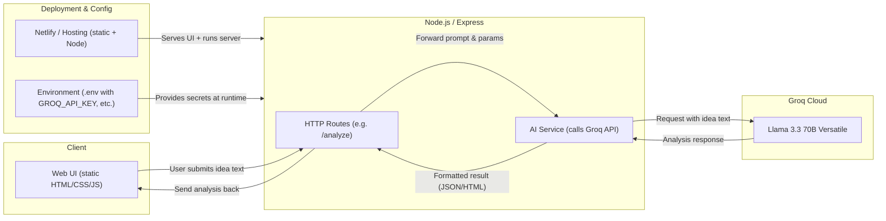

<div align="center">
  
  <h1>IdeaRank</h1>
  <p><strong>The Professional AI-Powered Startup Analysis Engine</strong></p>
  <p><em>Founded by <a href="https://GitHub.com/Byte-ne">Tanay Mishra</a> in 2026</em></p>

  [](https://opensource.org/licenses/MIT)
  [](https://nodejs.org/)
  [-darkviolet.svg)](https://groq.com/)
  <br>
  <a href="https://idearank.netlify.app">🌐 Visit</a> •
  <a href="https://github.com/Byte-ne/idearank">📦 GitHub</a>
  <br>
  [](https://app.netlify.com/projects/idearank/deploys)
  [](https://github.com/Byte-ne/IdeaRank/stargazers)
</div>

<br/>

IdeaRank is a lightning-fast web application designed to help founders, product managers, and advisors evaluate startup ideas and problems using structured, deep AI analysis. It turns simple 1-sentence ideas into comprehensive business reports. 
The Platform is Not yet monetized, and is currently COMPLETELY FREE & UNLIMITED to use.

---

## Features

<table>
  <tr>
    <td width="50%">
      <h3> Deep Idea Ranking</h3>
      <p>Enter an idea and get a comprehensive scorecard (1-10) evaluating TAM/SAM/SOM, Competition, and Execution complexity.</p>
    </td>
    <td width="50%">
      <h3> Idea Improver (Pivots)</h3>
      <p>Have a weak idea? The Idea Improver engine suggests realistic strategic pivots, complete with a 3-Phase Execution Roadmap.</p>
    </td>
  </tr>
  <tr>
    <td width="50%">
      <h3> Critical SWOT Analysis</h3>
      <p>No fluff. Honest assessments of Strengths, Weaknesses, Opportunities, and Threats for any given concept.</p>
    </td>
    <td width="50%">
      <h3> Verified Sources</h3>
      <p>The AI suggests real-world sources (like TechCrunch, Statista) to back up its market claims, promoting transparency.</p>
    </td>
  </tr>
    <tr>
    <td width="50%">
      <h3> Shareable Scorecards</h3>
      <p>Download your analysis as a beautifully formatted image scorecard to share with co-founders or investors.</p>
    </td>
    <td width="50%">
      <h3> Mobile Optimized</h3>
      <p>A responsive glassmorphism UI with bottom navigation, ensuring deep analysis is accessible on the go.</p>
    </td>
  </tr>
</table>

---

## Tech Stack

IdeaRank is built to be lightweight, fast, and highly customizable.

- **Frontend:** HTML5, Vanilla JavaScript, CSS3 (Custom Design System with CSS variables and flex/grid).
- **Backend:** Node.js, Express.js.
- **AI Engine:** [Groq SDK](https://groq.com/) utilizing the `llama-3.3-70b-versatile` model for instant inferences.
- **Utilities:** `html2canvas` for scorecard generation.

---

## Getting Started

### Prerequisites

- [Node.js](https://nodejs.org/) (v16 or higher)
- A free API key from [Groq Console](https://console.groq.com/)

### Installation

1. **Clone the repository:**
   ```bash
   git clone https://github.com/Byte-ne/IdeaRank.git
   cd IdeaRank
   ```

2. **Install dependencies:**
   ```bash
   npm install
   ```

3. **Configure Environment Variables:**
   Create a `.env` file in the root directory (you can use `.env.example` as a template):
   ```env
   # Your primary Groq API Key
   GROQ_API_KEY=gsk_your_primary_key_here
   
   # Fallback API Key for rate limits (Optional but Recommended)
   GROQ_API_KEY_BACKUP=gsk_your_backup_key_here
   
   # Server Port
   PORT=3000
   ```

4. **Run the application:**
   ```bash
   npm start
   ```
   *The server will start on `http://localhost:3000`.*

---

## Project Structure

```
IdeaRank/
├── public/                 # Static frontend files
│   ├── index.html          # Landing page
│   ├── dashboard.html      # Main analysis interface
│   ├── style.css           # Global custom UI styles
│   ├── script.js           # Frontend logic & API calls
│   └── logo.png            # Application branding
├── routes/                 # Express API routes
│   ├── ideaRank.js         # Endpoint for primary analysis
│   └── ideaImprove.js      # Endpoint for strategic pivot generation
├── services/               # Core business logic
│   └── aiService.js        # Groq API integration and prompt engineering
├── .env                    # Environment variables (gitignored)
├── server.js               # Node.js Express server setup
└── package.json            # Project dependencies & scripts
```

---

## Current architecture

IdeaRank is a simple, stateless web app: the browser sends your idea to a Node/Express API, which calls Groq (Llama 3.3) and returns the analysis. No database, no sign‑in, no data stored between requests.

- **Client (Web UI)**  
  - Static HTML/CSS/JS served to the browser.  
  - When you click “Analyze”, it sends an HTTP request (e.g. `POST /analyze`) with your idea text.

- **Server (Node.js / Express)**  
  - API routes (like `/analyze`) receive the request, read and validate the idea text.  
  - The route calls an internal AI service that:
    - Builds the prompt and payload.
    - Calls the Groq API with your idea.
    - Parses the response into a structured result (JSON/text sections).  
  - The API then sends this result back to the browser as JSON or rendered HTML.

- **AI (Groq / Llama 3.3)**  
  - The actual model runs on Groq’s cloud.  
  - IdeaRank never stores your ideas; it just forwards them to Groq and returns the model’s reply.

- **Infra & config**  
  - Hosted on a static+Node platform (e.g. Netlify or similar) that serves the UI and runs the Express server.  
  - Secrets like `GROQ_API_KEY` are provided via environment variables (`.env`), not hard‑coded.

Mermaid diagram of the flow:



---

## Use cases

- Quickly validate hackathon or weekend‑project ideas.
- Give founders a “reality check” on market, competition, and execution risk.
- Use inside a startup studio or accelerator to triage many ideas.
- Integrate as an internal tool for product teams exploring new bets.

---

## Support

If IdeaRank helps you evaluate ideas or you find the code useful, please consider **starring** this repo.  
Stars help others discover the project and motivate future improvements.

---

## Contributing

Contributions are welcome! Please feel free to submit a Pull Request. For major changes, please open an issue first to discuss what you would like to change.

1. Fork the Project
2. Create your Feature Branch (`git checkout -b feature/AmazingFeature`)
3. Commit your Changes (`git commit -m 'Add some AmazingFeature'`)
4. Push to the Branch (`git push origin feature/AmazingFeature`)
5. Open a Pull Request

---

## License

Distributed under the MIT License. See `LICENSE` for more information.
